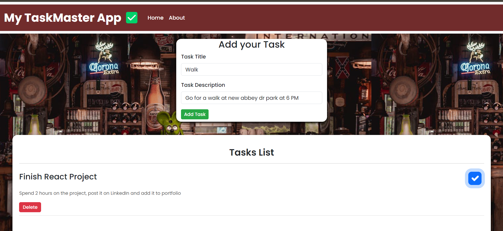

# My TaskMaster App - React

**Taskmaster** is a productivity application built with React that helps users manage their tasks efficiently. It provides a user-friendly interface for creating, updating, and tracking tasks.

## Features

- **Simple to Use**: Simple features, elegant User Interface
- **Task Creation**: Easily add new tasks with titles and descriptions.
- **Task Management**: Checkmark your completed tasks.
- **Task Deletion**: Delete unwanted your completed tasks.

## Technologies Used

 <h5 align="left">Languages</h5> 
     
  <h5 align="left">Frameworks and Libraries</h5> 
     
  <h5 align="left">Frameworks and Libraries</h5> 
   
  <h5 align="left">Frameworks and Libraries</h5> 
    
  <h5 align="left">Frameworks and Libraries</h5> 
     
- **React**: For building the user interface.
- **React Router**: For navigation and routing.
- **CSS**: For styling the application.
- **JSX**: For writing HTML-like code within JavaScript, which is compiled to JavaScript by React.

## Live Demo
Use the project here - [Taskmaster - created by Arsh Sandhu](https://react-taskmaster-app.vercel.app/)

## Preview

